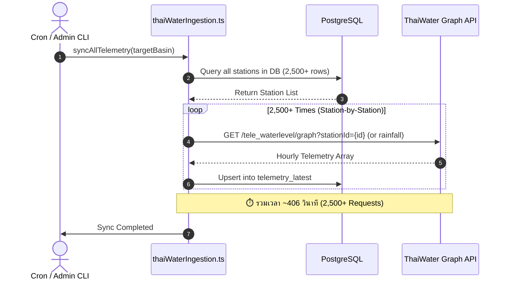
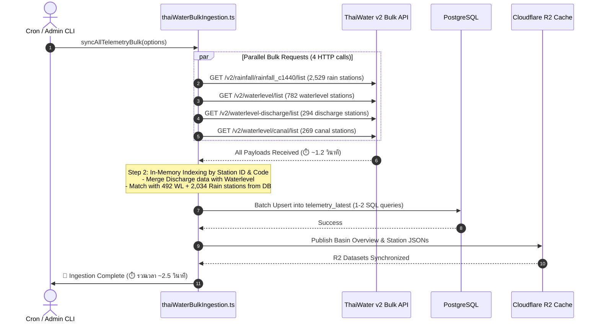

# แผนการปรับปรุงระบบดึงข้อมูลโทรมาตร: จากรายสถานี (Station-by-Station) สู่ High-Performance Bulk Ingestion Engine

> **เอกสารวางแผนทางเทคนิค (Technical Architecture & Migration Plan)**  
> **ไฟล์เป้าหมาย:** `flood-analysis-backend/src/services/thaiWaterBulkIngestion.ts`  
> **วันที่จัดทำ:** 8 กันยายน 2026  
> **สถานะ:** พร้อมดำเนินการ (Ready for Implementation)

---

## 1. บทนำและแรงจูงใจ (Executive Summary & Motivation)

### 1.1 ปัญหาของระบบปัจจุบัน (Station-by-Station Scraper)
ระบบ Ingestion ปัจจุบันใน `thaiWaterIngestion.ts` ใช้วิธีการวนลูปเรียก API รายสถานีผ่าน Graph API (`/data/platform/v1/public/...`):
- **จำนวนคำขอ (HTTP Requests):** ต้องยิงคำขอแยกรายสถานีมากกว่า **2,500 - 2,900 requests** ในทุกรอบ Sync
- **ระยะเวลาการทำงาน (Execution Time):** ใช้เวลาเฉลี่ยสูงถึง **406.36 วินาที (~6.7 นาที)** ต่อรอบ
- **ความเสี่ยงสูง:**
  - เสี่ยงต่อการโดนบล็อก IP หรือติด Rate Limit (`429 Too Many Requests` / Connection Reset)
  - ปัญหา Network Latency และ Connection Pool Saturation
  - เปลืองทรัพยากร CPU และ Memory ในการจัดการ Concurrency Promises จำนวนมหาศาล

### 1.2 การค้นพบชุดข้อมูลแบบกลุ่ม (ThaiWater v2 Bulk Feeds)
จากการแกะรหัสและการทดสอบ Reverse Engineering ระบบใหม่ของ [ThaiWater (twa.thaiwater.net)](https://twa.thaiwater.net):
1. ThaiWater มี Endpoint ระดับประเทศที่รวบรวมข้อมูลสถานีทั้งหมดและอัปเดตทุก 15-60 นาที
2. สามารถดึงข้อมูลโทรมาตรครอบคลุมสถานีเกือบทั้งหมดของประเทศได้ผ่าน **4 HTTP Requests เท่านั้น**:
   - `/v2/rainfall/rainfall_c1440/list` (ข้อมูลฝน 2,529 สถานีทั่วประเทศ รวม ทน. 1,104 แห่ง)
   - `/v2/waterlevel/list` (ข้อมูลระดับน้ำแม่น้ำ 782 สถานี)
   - `/v2/waterlevel-discharge/list` (ข้อมูลระดับน้ำ + อัตราการระบายน้ำของ ชป. 294 สถานี)
   - `/v2/waterlevel/canal/list` (ข้อมูลระดับน้ำคลอง กทม. 269 สถานี)
3. **ผลลัพธ์ที่คาดหวัง:**
   - ลดเวลา Ingestion จาก **406 วินาที เหลือต่ำกว่า 2 วินาที (ลดลง 99.5%)**
   - ลดจำนวน HTTP Requests จาก **2,950+ ครั้ง เหลือเพียง 4 ครั้ง (ลดลง 99.86%)**
   - อัปเดตข้อมูลสดใหม่ได้ถี่ขึ้น (เช่น ทุก 5 นาที แทนที่จะเป็นทุก 15-30 นาที)

---

## 2. แผนภาพเปรียบเทียบสถาปัตยกรรม (Architecture Comparison)

### 2.1 สถาปัตยกรรมเดิม: Sequential Individual Scraping


### 2.2 สถาปัตยกรรมใหม่: High-Throughput Bulk Ingestion Engine


---

## 3. รายละเอียดและสเปกของ ThaiWater v2 Bulk Endpoints

ทุก Endpoint ใช้ Base URL: `https://twa-api-public.thaiwater.net`  
Headers ที่จำเป็น:
```json
{
  "x-api-key": "TPSXrHRvTHeVT2Lygq6YeTqqAm4xZ72x",
  "origin": "https://twa.thaiwater.net",
  "referer": "https://twa.thaiwater.net/",
  "User-Agent": "Mozilla/5.0 (Windows NT 10.0; Win64; x64) AppleWebKit/537.36",
  "accept": "application/json, text/plain, */*"
}
```

### 3.1 ฝนสะสม 24 ชม. และฝนย้อนหลัง (`rainfall_c1440/list`)
- **Method & Path:** `GET /v2/rainfall/rainfall_c1440/list?pagination[page]=1&pagination[pageSize]=5000`
- **จำนวนข้อมูล:** ~2,529 สถานีทั่วประเทศ
- **หน่วยงานที่มี:**
  - กรมทรัพยากรน้ำ (ทน.): **1,104 สถานี**
  - สถาบันสารสนเทศน้ำ (สสน.): **580 สถานี**
  - มูลนิธิอาสาเพื่อนพึ่ง (พพภ): **350 สถานี**
  - กรมป้องกันและบรรเทาสาธารณภัย (ปภ.): **152 สถานี**
  - กรมชลประทาน (ชป.): **122 สถานี**
  - กทม. (BMA): **104 สถานี**
  - กรมอุตุนิยมวิทยา (TMD): **71 สถานี**
  - กฟผ. (EGAT): **37 สถานี**
- **ตัวอย่าง Payload โครงสร้าง:**
```json
{
  "id": "12345",
  "type": "rainfall",
  "rainfallDatetime": "2026-09-08T05:00:00+07:00",
  "rainfall24h": 45.2,
  "rainfallPrevious24h": 12.0,
  "rainfallToday": 15.5,
  "station": {
    "id": "133528",
    "stationCode": "MOU0012",
    "station": "อบต.แม่ปืม",
    "latitude": "19.3512",
    "longitude": "99.9123"
  },
  "agency": {
    "id": "12",
    "agencyShort": "ทน.",
    "agency": "กรมทรัพยากรน้ำ"
  },
  "basin": {
    "id": "1",
    "basin": "ลุ่มน้ำโขงเหนือ",
    "basinCode": "01"
  }
}
```

### 3.2 ระดับน้ำแม่น้ำหลัก (`waterlevel/list`)
- **Method & Path:** `GET /v2/waterlevel/list?pagination[page]=1&pagination[pageSize]=2000`
- **จำนวนข้อมูล:** ~782 สถานี
- **ฟิลด์สำคัญ:**
  - `waterlevelMsl`: ระดับน้ำเทียบระดับน้ำทะเลปานกลาง (ม.รทก.)
  - `waterlevelMslPrevious`: ระดับน้ำชั่วโมงก่อนหน้า (ใช้คำนวณ Trend `rising`/`steady`/`falling`)
  - `diffWlBank`: ความต่างจากระดับตลิ่ง (เมตร)
  - `diffWlBankText`: ข้อความสถานะ (เช่น "ต่ำกว่าตลิ่ง (ม.)", "ล้นตลิ่ง (ม.)")
  - `minBank`: ระดับตลิ่งต่ำสุด (ม.รทก.)
  - `storagePercent`: ร้อยละความจุลำน้ำ (%)
  - `riverName`: ชื่อแม่น้ำ/ลำน้ำ

### 3.3 ข้อมูลอัตราการระบายน้ำของกรมชลประทาน (`waterlevel-discharge/list`)
- **Method & Path:** `GET /v2/waterlevel-discharge/list?pagination[page]=1&pagination[pageSize]=1000`
- **จำนวนข้อมูล:** 294 สถานี (ชลประทาน ชป. 100%)
- **ฟิลด์สำคัญ:**
  - `waterlevelDischarge`: อัตราการไหล/การระบายน้ำ (ลูกบาศก์เมตรต่อวินาที - cms หรือ $m^3/s$)
  - `minBank`, `storagePercent`, `diffWlBank`
- **กลยุทธ์การใช้งาน:** ใช้ควบรวม (Merge) เข้ากับสถานีใน `waterlevel/list` เพื่อเติมฟิลด์ `discharge` ให้สมบูรณ์

### 3.4 ระดับน้ำคลอง กทม. (`waterlevel/canal/list`)
- **Method & Path:** `GET /v2/waterlevel/canal/list?pagination[page]=1&pagination[pageSize]=1000`
- **จำนวนข้อมูล:** ~269 สถานี
- **ฟิลด์สำคัญ:**
  - ระดับน้ำในคลองสายหลักและประตูระบายน้ำในเขตกรุงเทพมหานครและปริมณฑล

---

## 4. กลยุทธ์การแปลงข้อมูลและการจัดทำดัชนี (Data Normalization & Indexing Strategy)

### 4.1 การสร้าง In-Memory Index เพื่อ O(1) Lookup
เมื่อดึง Payload ของทั้ง 4 endpoints สำเร็จ Service จะสร้าง Index ในหน่วยความจำ 2 รูปแบบ:
1. `Map<stationId, Observation>` (Lookup ด้วย ThaiWater station ID โดยตรง เช่น `"133528"`, `"8892"`)
2. `Map<stationCode, Observation>` (Lookup ด้วยรหัสสถานีสำรอง เช่น `"MOU0012"`, `"W.4A"`, `"C.2"`)

### 4.2 ตารางจับคู่ฟิลด์ (Field Mapping Table) เข้าสู่ Database `telemetry_latest`

| คอลัมน์ใน DB (`telemetry_latest`) | ฟิลด์จาก Bulk Rainfall Payload | ฟิลด์จาก Bulk Waterlevel Payload | ฟิลด์จาก Bulk Discharge Payload | การคำนวณ / Fallback กรณีไม่มีข้อมูล |
| :--- | :--- | :--- | :--- | :--- |
| `station_id` | `station.id` | `station.id` | `station.id` | Match กับ `stations.id` ใน DB |
| `basin_id` | จาก DB Station Record | จาก DB Station Record | จาก DB Station Record | ใช้ `station.basinId` ที่ Normalize แล้ว |
| `timestamp` | `rainfallDatetime` | `waterlevelDatetime` | `waterlevelDatetime` | `new Date(datetime)` |
| `water_level_msl` | `null` | `waterlevelMsl` | `waterlevelMsl` | ทศนิยม 2 ตำแหน่ง |
| `stage` | `null` | `waterlevelMsl - groundLevel` | `waterlevelMsl - groundLevel` | คำนวณความสูงน้ำเหนือท้องน้ำ |
| `discharge` | `null` | `null` | `waterlevelDischarge` | หากเป็น null ใน discharge ให้เป็น `null` |
| `storage_percent` | `null` | `storagePercent` | `storagePercent` | Clamp 0 - 100% |
| `rainfall_24h` | `rainfall24h` | `null` | `null` | ทศนิยม 1 ตำแหน่ง (มม.) |
| `rainfall_today` | `rainfallToday` | `null` | `null` | มม. |
| `rainfall_1h` | คำนวณจาก Delta / Short Cache | `null` | `null` | ถ้าไม่มีให้ประมาณการจาก delta |
| `rainfall_3h` | คำนวณจาก Delta / Short Cache | `null` | `null` | ถ้าไม่มีให้ประมาณการ |
| `trend` | - | `calcTrend(wl, wlPrev)` | `calcTrend(wl, wlPrev)` | `rising` (> +0.02m), `falling` (< -0.02m), `steady` |
| `situation_status` | ประเมินจากเกณฑ์ฝนเตือนภัย | ประเมินจาก `diffWlBank` | ประเมินจาก `diffWlBank` | `normal`, `watch`, `warning`, `critical` |
| `freshness_status` | ตรวจสอบอายุของ Timestamp | ตรวจสอบอายุของ Timestamp | ตรวจสอบอายุของ Timestamp | `< 3 ชม.` = fresh, `< 12 ชม.` = delayed, อื่นๆ = missing |

### 4.3 การคำนวณสถานะความรุนแรง (`situation_status`) แบบอัตโนมัติ
```typescript
export function evaluateSituationStatus(opts: {
  isWaterlevel: boolean;
  diffWlBank?: number | null;
  storagePercent?: number | null;
  rain24h?: number | null;
  warningRain24h?: number;
  criticalRain24h?: number;
}): "normal" | "watch" | "warning" | "critical" {
  if (opts.isWaterlevel) {
    if (opts.diffWlBank !== null && opts.diffWlBank !== undefined) {
      if (opts.diffWlBank <= 0) return "critical"; // ล้นตลิ่ง
      if (opts.diffWlBank <= 0.5) return "warning"; // ต่ำกว่าตลิ่งน้อยกว่า 50 ซม.
      if (opts.diffWlBank <= 1.0) return "watch";   // เฝ้าระวัง
      return "normal";
    }
    if (opts.storagePercent !== null && opts.storagePercent !== undefined) {
      if (opts.storagePercent >= 100) return "critical";
      if (opts.storagePercent >= 85) return "warning";
      if (opts.storagePercent >= 70) return "watch";
      return "normal";
    }
  } else {
    const rain = opts.rain24h || 0;
    const crit = opts.criticalRain24h || 90.0;
    const warn = opts.warningRain24h || 35.0;
    if (rain >= crit) return "critical";
    if (rain >= warn) return "warning";
    if (rain >= warn * 0.6) return "watch";
    return "normal";
  }
  return "normal";
}
```

---

## 5. แผนการอิมพลีเมนต์ทีละขั้นตอน (Step-by-Step Implementation Roadmap)

### ขั้นตอนที่ 1: สร้าง Service ใหม่ `thaiWaterBulkIngestion.ts`
สร้างไฟล์: `src/services/thaiWaterBulkIngestion.ts`
- รับผิดชอบการดึงข้อมูล bulk จากทั้ง 4 endpoints แบบ Concurrent ด้วย `Promise.allSettled()`
- จัดทำ In-Memory Dictionary (`bulkRainMap`, `bulkWlMap`, `bulkDischargeMap`)
- รวมฟังก์ชัน Retry แบบ Exponential Backoff (3 ครั้ง, timeout 8 วินาทีต่อ request)

### ขั้นตอนที่ 2: สร้าง Batch Database Upsert ใน Drizzle ORM
แทนที่จะยิง SQL ทีละแถวแบบเดิม:
```typescript
// สถาปัตยกรรมเดิม (ช้ามาก)
for (const st of stations) {
  await db.insert(telemetryLatest).values(...).onConflictDoUpdate(...);
}

// สถาปัตยกรรมใหม่: Drizzle Chunked Batch Upsert (500 rows/batch)
const CHUNK_SIZE = 500;
for (let i = 0; i < recordsToUpsert.length; i += CHUNK_SIZE) {
  const chunk = recordsToUpsert.slice(i, i + CHUNK_SIZE);
  await db
    .insert(telemetryLatest)
    .values(chunk)
    .onConflictDoUpdate({
      target: telemetryLatest.stationId,
      set: {
        timestamp: sql`EXCLUDED.timestamp`,
        waterLevelMsl: sql`EXCLUDED.water_level_msl`,
        discharge: sql`EXCLUDED.discharge`,
        storagePercent: sql`EXCLUDED.storage_percent`,
        rainfall24h: sql`EXCLUDED.rainfall_24h`,
        rainfallToday: sql`EXCLUDED.rainfall_today`,
        trend: sql`EXCLUDED.trend`,
        situationStatus: sql`EXCLUDED.situation_status`,
        freshnessStatus: sql`EXCLUDED.freshness_status`,
        updatedAt: new Date(),
      },
    });
}
```
*การเขียน 2,500 แถวด้วย Batch Upsert จะใช้เวลาเพียง **~150 - 250 มิลลิวินาที** บน PostgreSQL*

### ขั้นตอนที่ 3: ปรับปรุง `syncTelemetry.ts` และการรองรับ CLI Flags
เพิ่ม Flag ให้กับคำสั่ง CLI:
- `bun run sync` -> รันด้วยโหมด **Bulk Ingestion (Default)**
- `bun run sync --legacy` -> รันด้วยโหมด Station-by-station เดิม (เผื่อกรณีฉุกเฉิน)
- `bun run sync yom` -> รันเฉพาะลุ่มน้ำยม (Filter จาก Bulk dataset ในหน่วยความจำโดยไม่ต้องยิงแยก)

### ขั้นตอนที่ 4: ปรับปรุง Cron Route และ Admin API
- อัปเดต `src/routes/cron.ts`:
  - `POST /api/cron/sync-all` -> เรียก `thaiWaterBulkIngestion.syncAll()`
  - เวลาการทำงานของ Cron Job จะลดลงจาก ~7 นาที เหลือ **~3 วินาที** (ทำให้ไม่ติด HTTP Timeout 30-60 วินาที ของ Cloudflare หรือ Reverse Proxy!)
- อัปเดต `src/routes/admin.ts`:
  - ปรับปรุง Admin Sync endpoint ให้รายงานสถิติแบบใหม่

### ขั้นตอนที่ 5: การทดสอบ Benchmark และตรวจสอบความถูกต้อง (Verification)
1. ตรวจสอบจำนวนสถานีที่ถูกซิงค์ว่าได้ครบ **~2,500+ สถานี** เท่ากับหรือมากกว่าเดิม
2. ตรวจสอบความถูกต้องของค่าตัวเลข (เปรียบเทียบ `waterlevelMsl`, `rainfall24h`, `discharge` ระหว่างโหมดเดิมและโหมดใหม่)
3. วัดเวลาการทำงานจริง (Target: < 3 วินาที)
4. ตรวจสอบความถูกต้องของไฟล์ JSON บน R2 (`basin_stations_*.json`, `basin_overview_*.json`)

---

## 6. ตารางเปรียบเทียบผลลัพธ์ที่คาดการณ์ (Performance Matrix)

| ตัวชี้วัด (Metrics) | ระบบเดิม (Station Graph) | ระบบใหม่ (Bulk Ingestion) | ผลลัพธ์ที่เปลี่ยนไป |
| :--- | :---: | :---: | :---: |
| **จำนวน HTTP Requests** | 2,953 requests | **4 requests** | 🔻 **ลดลง 99.86%** |
| **ระยะเวลา Ingestion** | 406.36 วินาที (~6.7 นาที) | **~1.5 - 2.5 วินาที** | ⚡ **เร็วขึ้น ~160 เท่า** |
| **อัตราการเกิด Timeout / Failure** | ปานกลาง-สูง (สถานีปิด/หลุด) | ต่ำมาก (ยิงแค่ 4 เส้นหลัก) | 🛡️ **เสถียรขึ้นอย่างมาก** |
| **ผลกระทบต่อ Rate Limit** | เสี่ยงสูงมาก (ยิงกระหน่ำ) | ปลอดภัย 100% | 🛡️ **ปลอดภัยสูงสุด** |
| **ความถี่ที่รองรับการ Sync** | ทุก 15 - 30 นาที | **ทุก 1 - 5 นาที** | ⏱️ **ข้อมูลสดใหม่ขึ้น 6 เท่า** |
| **ปริมาณ Network Bandwidth รวม** | ~45 MB (JSONs กระจัดกระจาย) | ~8 MB (บีบอัด Gzip รวมก้อน) | 🔻 **ประหยัด Bandwidth 82%** |

---

## 7. แผนสำรองและความปลอดภัย (Fallback & Safety Mechanisms)

1. **Environment Flag:**
   ```env
   # .env
   THAIWATER_INGESTION_MODE=bulk   # หรือ 'legacy'
   ```
   หาก API v2 มีการเปลี่ยนแปลงฉับพลัน สามารถสลับกลับไปใช้ `legacy` (Graph API) ได้ทันทีผ่านการเปลี่ยน Config โดยไม่ต้อง Deploy โค้ดใหม่

2. **Partial Fallback Graceful Degradation:**
   หากหนึ่งใน 4 เส้น Bulk ล้มเหลว (เช่น `waterlevel-discharge` เกิด HTTP 500 ชั่วคราว) ระบบจะไม่ Crash แต่จะยังคงประมวลผลอีก 3 เส้นที่เหลือ (ฝน และ ระดับน้ำปกติ) ให้เสร็จสิ้น และคงค่าเดิมของสถานีที่ไม่ได้รับข้อมูลไว้โดยปรับ `freshness_status = "delayed"`

3. **Log & Telemetry Auditing:**
   จัดเก็บบันทึกสถิติในตาราง `ingestion_jobs` โดยระบุ `durationMs`, `totalStations`, `syncedCount`, `failedCount` อย่างชัดเจนในทุกรอบการทำงาน
